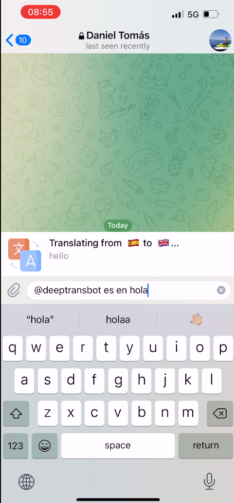
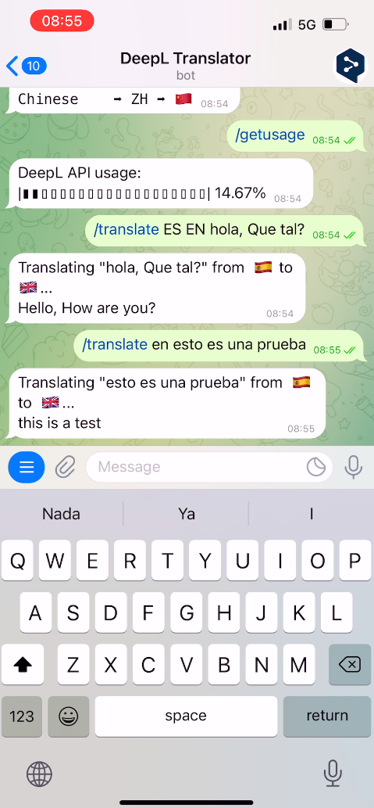
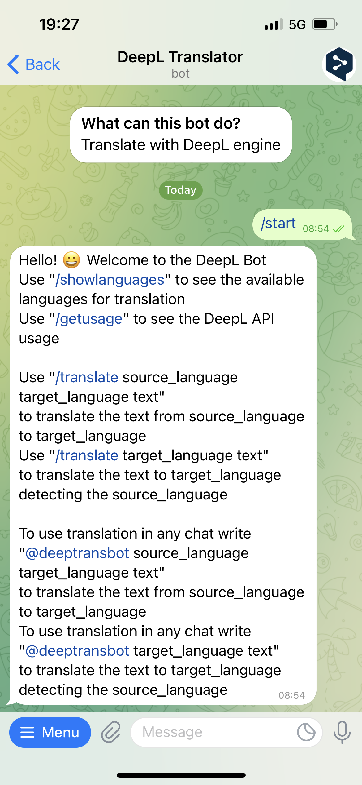
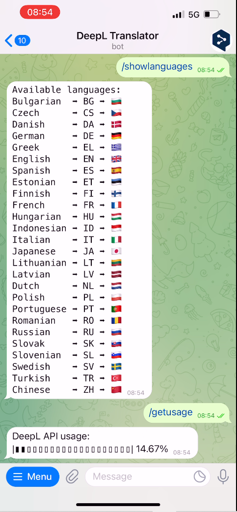

# 🤔 DeepL Translator - DeepL Translation bot for Telegram 😎

_DeepL Translator_ is a Telegram bot that provides a simple way to get translations for messages sent in your chats. Simply use _Deep Translator_ into chats that you wish to send translations in, tagging the bot and providing the language and text that you want to send translated, and let the magic happen! ✨  
Also you can translate your messages in the bot chat or check which languages are supported by the bot.

## Usage

There are two main ways of interacting with the bot sending and receiving translations:

   Most users choose to request translations by tagging the telegram bot (@) followed by the origin name (optional), destiny name and text to translate. That is _@deepltranslator es hello_     |  For receiveing a translation you can also use the  `/translate <origin language> <target language> <text>` Telegram command in the chat of the Bot. 
:-------------------------:|:-------------------------:
  | 

<!-- 
1. Most users choose to request translations by tagging the telegram bot (@) followed by the origin name (optional), destiny name and text to translate. That is _@deepltranslator es hello_

2. For receiveing a translation you can also use the  `/translate <origin language> <target language> <text>` Telegram command in the chat of the Bot.

 
-->
 
  
There are three more commands to obtain information about the API and the bot:
 To find out about the telegram bot commands you can use `/help`     |  To find out about the languages availables for translation you can use `/showlanguages`   To find out about the percentage of usage of your API you can use `/getusage` 
:-------------------------:|:-------------------------:
  | 
  
  
<!-- 
1. To find out about the languages availables for translation you can use `/showlanguages`
2. To find out about the percentage of usage of your API you can use `/getusage` 
3. To find out about the telegram bot commands you can use `/help`

 -->

  
## Prerequisites

To run the bot, you must fullfil the following requirements:

- Have a DeepL API key (provided with a [DeepL API Free](https://www.deepl.com/pro#developer) or [DeepL API Pro plans](https://www.deepl.com/pro#developer))
- Have a Telegram Bot and its key

## Deployment

To deploy _Deep Translator_ and make your bot work:
  
- Save the environment variable `DEEPL_TOKEN` with your DeepL API key
- Save the enviorment variable `BOT_TOKEN` with your Telegram Bot key
- Export the enviroment variables
- Install dependencies with `mix deps.get`
- Compile the project with `mix compile`
- Start your bot with `mix run --no-halt`

